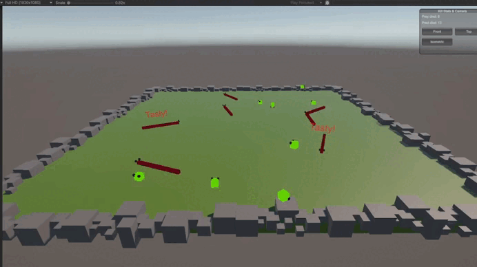

# 🐾🐾 Zoo World

  
  

**Zoo World** is a 3D game where you can observe different animals interacting in a simple ecosystem. This project was developed to demonstrate extensible architecture.

---

## 📜 Description

Modular 3D animal ecosystem demo showcasing DI and architecture.

## 🧱 Animal Architecture

- **Animal**: Abstract `MonoBehaviour` base  
- **Prey**: Extends `Animal`; holds `IMovement` + `IKnockback`; knocks back other prey on collision  
- **Predator**: Extends `Animal`; holds `IMovement`, `IHunt` + `IConflict`; hunts prey and resolves predator–predator conflicts  
- **Frog**: `Prey` implementation; injects `IMovement`/`IKnockback`, auto-jumps on `OnMovementCompleted`  
- **Snake**: `Predator` implementation; injects `IMovement`/`IHunt`/`IConflict`, auto-slithers on `OnMovementCompleted`  
- **Interfaces**:  
  - `IMovement` ⇒ `Move(animal, target)` + `OnMovementCompleted`  
  - `IKnockback` ⇒ `Move(animal, direction)` + `OnMovementCompleted`  
  - `IHunt` ⇒ `Hunt(hunter, prey)` + `OnHuntCompleted`  
  - `IConflict` ⇒ `Conflict(a, b)` + `OnConflictCompleted`  
- **DI**: Zenject `[Inject]` wiring for all behaviors

## 🏗️ Extensibility & Architecture

- **Modular Design**: Project structured into folders (`Core`, `Animals`, `Systems`, `UI`, `VisualEffects`), making it straightforward to add new features or animal types.
- **Dependency Injection**: Leveraged Zenject to resolve dependencies at runtime.

## 🚀 Quick Start

1. Clone the repository.  
2. Open in Unity (2021.3 LTS or newer).  .  
3. Enter Play mode to see animals spawning, moving, and interacting.
---
**Enjoy exploring Zoo World and extending it with your own animal behaviors!**
